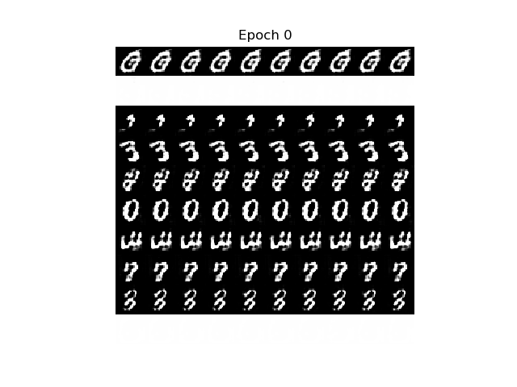
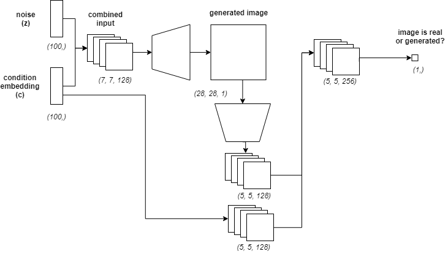

# Conditional Deep Convolutional GAN (CDCGAN) - Keras Implementation

 

## Model

 

## About

Gábor Vecsei

- [Website](https://gaborvecsei.com)
- [Personal Blog](https://gaborvecsei.wordpress.com/)
- [LinkedIn](https://www.linkedin.com/in/gaborvecsei)
- [Twitter](https://twitter.com/GAwesomeBE)
- [Github](https://github.com/gaborvecsei)
