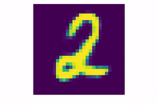
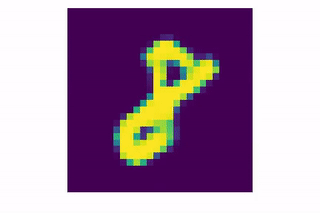
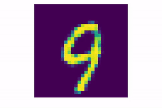

# Conditional Deep Convolutional GAN (CDCGAN) - Keras Implementation

Generated digits at every epoch:

Linear interpolation results:

## Model

This is the abstract representation of the model just to get a "bird eye view" for better understanding.

 

## Training

Just run the script `cdcgan/cdcgan_train.py`

## Weights & Tensorboard logs

Check the releases, for the latest models weights, and tensorboard logs, where you can see the generated images
loss and the model graph

## About

Gábor Vecsei

- [Website](https://gaborvecsei.com)
- [LinkedIn](https://www.linkedin.com/in/gaborvecsei)
- [Twitter](https://twitter.com/GAwesomeBE)
- [Personal Blog](https://gaborvecsei.wordpress.com/)
- [Github](https://github.com/gaborvecsei)
